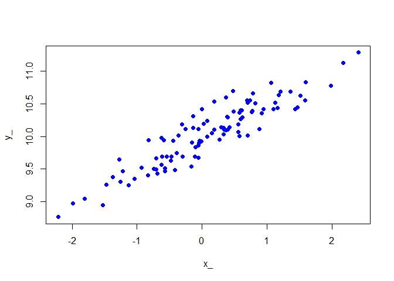

Rshadow basics
================

## Overview

In this tutorial, we declare standard regression models and examine
how `Rshadow` can enhance the flexibility of these models.

## Our first model

We begin with a simple linear regression case. Let’s simulate some
data under the model $y \sim y_0 + \beta x + \epsilon$,

``` r
set.seed(1)
n  <- 100
y0_ <- 10
beta_ <- 0.5
sigma_ <- 0.2

x_ <- rnorm(n)
err <- rnorm(n)
y_ <- y0_ + beta_ * x_ + sigma_ * err
```

The result is a simple curve:

<!-- -->

A standard least-squares fit of the linear regression model recovers the
intercept `y0_`, the slope coefficient `beta_`, the residual standard
error $\approx 0.2$, and the coefficient standard error
$\sigma / \sqrt n \approx 0.02$

``` r
summary(lm(y_ ~ x_))
```

    ## 
    ## Call:
    ## lm(formula = y_ ~ x_)
    ## 
    ## Residuals:
    ##     Min      1Q  Median      3Q     Max 
    ## -0.3754 -0.1227 -0.0279  0.1079  0.4692 
    ## 
    ## Coefficients:
    ##             Estimate Std. Error t value Pr(>|t|)    
    ## (Intercept)  9.99246    0.01940   515.1   <2e-16 ***
    ## x_           0.49979    0.02155    23.2   <2e-16 ***
    ## ---
    ## Signif. codes:  0 '***' 0.001 '**' 0.01 '*' 0.05 '.' 0.1 ' ' 1
    ## 
    ## Residual standard error: 0.1926 on 98 degrees of freedom
    ## Multiple R-squared:  0.8459, Adjusted R-squared:  0.8444 
    ## F-statistic: 538.1 on 1 and 98 DF,  p-value: < 2.2e-16

Remark that implementing this explicitly without using the built-in R
function would require a fair amount of manipulations. We can now
illustrate the same model using Rshadow.

## Declaring the tape and the spies

The fist Rshadow object to understand is the `tape`. A `tape` represents
an underlying model for the SHADOw C++ backend. The model, including
data, free parameters, and hyperparameters, will be recorded on the
`tape`.

```r
library(Rshadow)
tape <- objective()
```

Once a `tape` has been created, free parameters are declared using the
`spy` function and associated with the `tape`. We must always provide an
initial value for these parameters – obviously, better starting
conditions lead to better and faster model fits, so care must be taken to provide
sensible initial values.

Rshadow requires that all free parameters
be declared **before** any actual computation. This requirement may be
relaxed in the future. Let’s declare and intercept, a coefficient and an
error standard deviation:

``` r
y0    <- spy(-5, tape)
beta  <- spy( 0, tape)
sigma <- spy( 3, tape)
```

We are ready to declare the model itself, first, by defining the
predicted values $\hat{y}=y_0 + \beta x$, then, by defining their
log-likelihood `ll`, the log density of the predictions under a normal
distribution with mean equal to the observations and standard deviation
equal to `sigma`. We use the built-in Rshadow function `ll_norm` for the
log-likelihood of the normal distribution.

``` r
yhat <- y0 + beta * x_
ll <- sum(ll_norm(yhat, y_, sigma))
```

That’s it, we have created our model. The next step is to call the
`maximize` function to obtain maximum-likelihood estimates of the free
parameters,

``` r
mle <- maximize(tape)
```

We retrieve the estimated values using the `read` function.

``` r
{
  cat(sprintf("Expected:  y0 = %.2f, beta = %.2f, sigma = %.2f\n", y0_, beta_, sigma_))
  cat(sprintf("Optimized: y0 = %.2f, beta = %.2f, sigma = %.2f", 
              read(y0, mle), read(beta, mle), read(sigma, mle)))
}
```

    ## Expected:  y0 = 10.00, beta = 0.50, sigma = 0.20
    ## Optimized: y0 = 9.99, beta = 0.50, sigma = 0.19

## What happened?

The objective the Rshadow package is to let the user declare their own
models without worrying about the complicated solving procedure. A
simple linear regression has a closed-form solution, but a logistic
regression does not: even this simple model requires specific numerical
optimization. Rshadow tries to provide numerical optimization to **any**
model.

When the `maximize` function is called, the `tape` object already holds
all the required operations and data. The underlying C++ backend handles
the optimization using a robust variant of the Newton method,
accelerated with 2nd-order automatic differentiation.

## Confidence intervals

Rshadow implements either asymptotic confidence intervals or likelihood
profile confidence intervals. The former are cheap to compute but
approximate, while the latter are much more robust but can become
computationally heavy in large models.

We can use the standard function `confint.asym` to obtain asymptotic
confidence intervals of all coefficients at once,

``` r
cf <- confint.asym(mle)
rownames(cf) <- c("y0", "beta", "sigma")
print(cf, digits=3)
```

    ##        2.5%  97.5%
    ## y0    9.955 10.030
    ## beta  0.458  0.542
    ## sigma 0.164  0.217

These confidence intervals match those of the usual R function

``` r
cf_lm <- confint(lm(y_ ~ x_))
print(cf_lm, digits = 3)
```

    ##             2.5 % 97.5 %
    ## (Intercept) 9.954 10.031
    ## x_          0.457  0.543

Remark that a confidence interval for `sigma` was generated by Rshadow
but not by usual R. This is because `sigma` is treated as a free
parameter of the model by Rshadow while it is a property of the
**solution** of the regression in the `lm` context.
